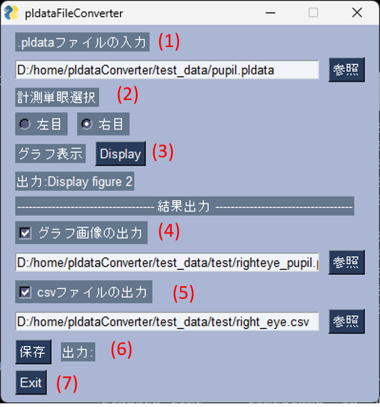
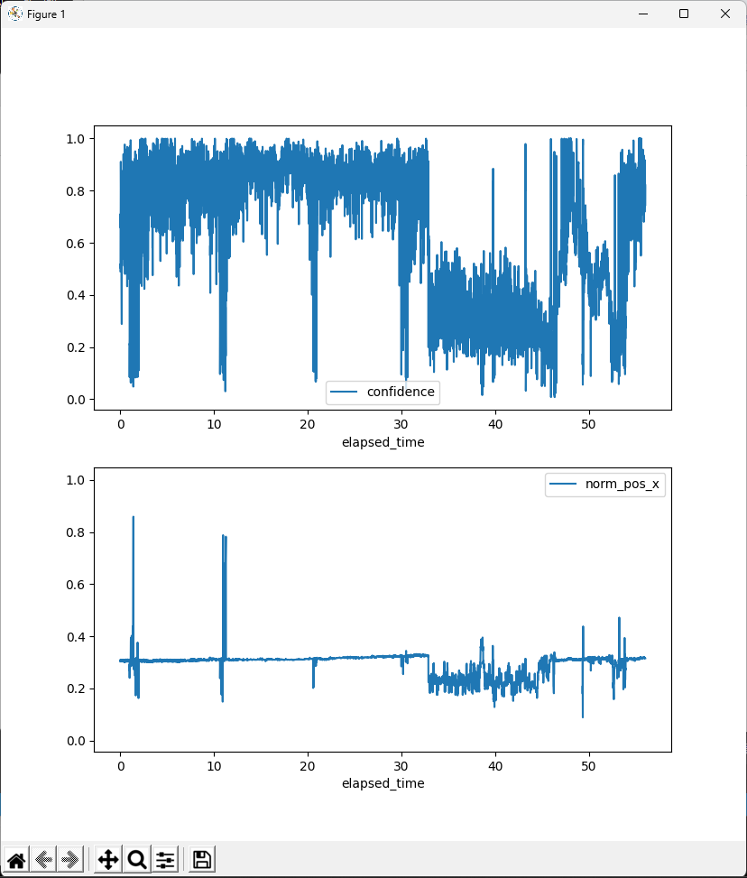

# pldataConverter
このプログラムはPupilLabのアイトラッキングシステムから出力された.pldataファイルの以下のデータを抽出、グラフ表示し、.csvファイルに出力するGUIソフトウェアのソースです。

# Overview
Pupillab社のアイトラッキングシステム（https://pupil-labs.com/）はpythonベースのSDKまたはpupilcapture.exeにより、瞳孔をトラッキングすることで視線や瞳孔など動きを単眼ごとに計測することができます。出力データには視線の軌跡情報やビデオ映像などが含まれます。付属のpupil_pupil.pldataには瞳孔径や動き情報が含まれ、pupil_service.exeによりエクセルファイルに書き出すことができますが、情報量が多いので以下の情報（'timestamp', 'id', 'method', 'confidence', 'norm_pos'）だけ抽出し、出力するソフトを作りました。取り出したい情報を変えるときはpupilLab_eye_fatigue_export_csv.pyのcolumnsの中身を書き変えてください。

# How to use
## ソフトウェアの起動方法 
pythonのソースコードを直接起動するか、.exeファイルをダブルクリックして起動してください。
.exeファイルはpyinstallerを使って作成しております。

## ソフトウェアの使い方
(1) .pldataファイルの入力：参照ボタンを押し、エクスポローラーから.pldataファイルを選択する。
(2) 計測単眼選択：出力したい目を選択
(3) グラフ表示：グラフを表示

(4) グラフ画像の出力：グラフ画像を出力するかをチェックし、参照ボタンを押し、エクスプローラーから出力ファイル名を指定
(5) csvファイルの出力：csvファイルを出力するかチェックをし、参照ボタンを押し、えっくぽローラから出力ファイル名を指定
(6) 保存：保存ボタンを押すと保存されます。
(7) Exit：ソフトウェアを終了します。

# Install
-必要なライブラリ
 -msgpack %　version 0.5 以上  
 -pandas  
 -numpy  
 -matplotlib  
 -PySimpleGUI  

# license
- MIT license

