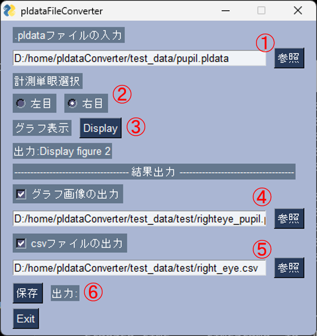
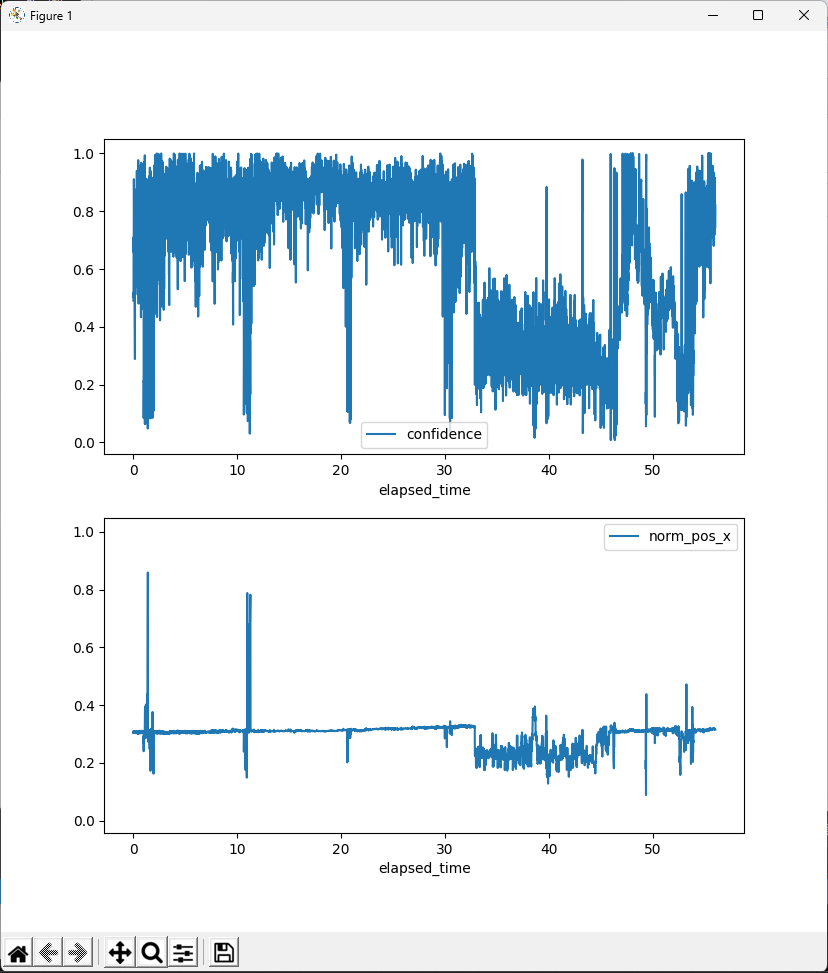

[Japanese version](./README-jp.md)

# pldataConverter
This program is a GUI software source that extracts data from .pldata files output by PupilLab's eye tracking system, displays them graphically, and outputs them to .csv files.

# Overview
 Pupillab's Eye Tracking System (https://pupil-labs.com/), available via a python-based SDK or pupilcapture.exe, tracks pupils to measure eye gaze, pupils, and other movements on a monocular basis. Output data includes gaze trajectory information and video footage. The included pupil_pupil.pldata contains pupil diameter and movement information, which can be exported to an Excel file by pupil_service.exe, but due to the large amount of information, the following information ('timestamp', 'id', 'method', However, the amount of information is very large, so we have created a software that extracts and outputs only the following information ('timestamp', 'id', 'confidence', 'norm_pos'). If you want to change the information to be extracted, change the contents of columns in pupilLab_eye_fatigue_export_csv.py. 

# How to use
## How to start the software 
Launch the python source code directly or by double-clicking on the .exe file.
The .exe file is created using pyinstaller.

- Launch from command line
$ python pldataFileConverter

- Launch from .exe file (builded by pyInstaller)
Double-click on pldataFileCoverter.exe in the dist folder to activate it.  

### How to make .exe file  
$ pyinstaller ./src/pldataFileConverter.py --onefile  

## How to use the software
(1) Input .pldata file: Press the Browse button and select a .pldata file from the exporer.  
(2) Select measurement monocular: Select the eye you want to output.  
(3) Display graph: Display graph  

(4) Output graph image: Check whether to output a graph image, press the Browse button, and specify the output file name from Explorer.  
(5) Output csv file: Check whether to output a csv file, press the Browse button, and specify the output file name from Explorer.  
(6) Save: Press the Save button to save the file.  
(7) Exit: Exit the software.  

# Install
-Required Libraries  
 -msgpack %　version 0.5 以上  
 -pandas  
 -numpy  
 -matplotlib  
 -PySimpleGUI  
 -PyInstaller  

# lisence
- MIT license

# Reference
[pupillab](https://docs.pupil-labs.com/developer/core/overview/)  
[pySimpleGUI](https://www.pysimplegui.org/en/latest/)  
[msgpack](https://msgpack.org/)  
[Reference for coding](https://qiita.com/issakuss/items/30759f9ed0e49c366009)  (In Japanese)  
[Reference for coding](https://qiita.com/makky0620/items/07dfe5414f5a38e322d1)  (In Jananese)  
[Reference for coding](https://qiita.com/issakuss/items/bfe2dc2dce6652ea710c)  (In Japanese)  

